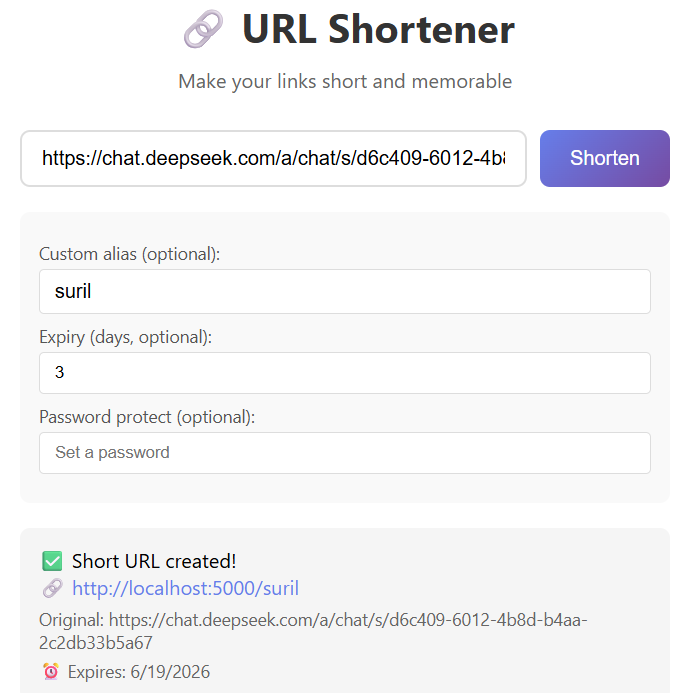
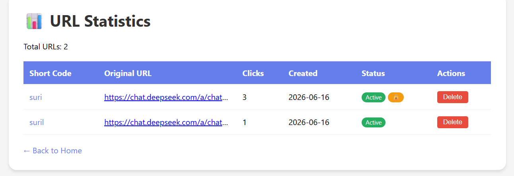

# 🔗 URL Shortener - Like bit.ly  

  
  
  

A professional URL shortener application that creates short, memorable links with analytics, password protection, and expiry dates. Perfect for marketing campaigns, social media, and link management.  

## Features  

- URL Shortening - Create short links from long URLs  
- Custom Aliases - Choose your own short codes  
- Password Protection - Secure links with passwords  
- Expiry Dates - Set expiration for temporary links  
- Click Analytics - Track clicks and view statistics  
- Web Interface - Beautiful and responsive UI  
- CLI Mode - Power user command-line interface  
- REST API - Programmatic URL shortening  
- Search URLs - Find links by original URL  
- Persistent Storage - JSON-based data storage  
- Delete Links - Remove unwanted URLs  
- Cross-Platform - Works on Windows, Linux, macOS  

## Quick Start  

### Prerequisites  
- Python 3.7 or higher  
- Install Flask: pip install flask  

### Installation  

1. Clone the repository:  
git clone https://github.com/poisonmunna/urlshortener.git  
cd urlshortener  

2. Install dependencies:  
pip install flask  

3. Run the web server:  
python URLShortener.py  

4. Open in browser:  
http://localhost:5000  

## Web Interface  

### Home Page  

============================================================  

🔗 URL Shortener  
============================================================  

[Enter URL to shorten...] [Shorten]  

Options:  
- Custom alias (optional): [________]  
- Expiry (days, optional): [____]  
- Password protect (optional): [________]  

[View All Shortened URLs]  
============================================================  

### Short URL Creation  

When you shorten a URL, you get:  
- ✅ Short URL: http://localhost:5000/abc123  
- ✅ Original URL: https://example.com/very-long-url  
- ✅ Expiry date (if set)  
- ✅ Password protection status  

### Statistics Page  

============================================================ 

📊 URL Statistics  

============================================================ 

| Short Code | Original URL | Clicks | Created | Status |  
|-----------|--------------|--------|---------|--------|  
| abc123 | example.com | 150 | 2024-06-16 | Active |  
| xyz789 | test.com | 45 | 2024-06-15 | Active |  
| mylink | custom.com | 10 | 2024-06-14 | Expired |  

============================================================  

## CLI Mode  

Run in CLI mode for power users:  
python url_shortener.py --cli  

### CLI Menu  

============================================================  
🔗 URL SHORTENER - CLI Mode  
============================================================  

📌 MENU  
========================================  
1. Shorten URL  
2. Get Stats  
3. List All URLs  
4. Search URLs  
5. Delete URL  
6. Start Web Server  
7. Exit  

========================================  

👉 Enter your choice (1-7): 1  

### CLI Example  

Enter URL to shorten: https://www.example.com/very-long-url  
Custom code (optional): mylink  
Expiry days (optional): 30  
Password protect (optional): mypassword  

✅ Short URL created!  
   Short URL: http://localhost:5000/mylink  
   Original: https://www.example.com/very-long-url  
   Expires: 2024-07-16  
   🔒 Password protected  

## API Endpoints  

### Shorten URL  

POST /shorten  
Content-Type: application/json  

{  
    "url": "https://example.com",  
    "custom_code": "mylink",  
    "expiry_days": 30,  
    "password": "mypassword"  
}  

Response:  
{  
    "short_code": "mylink",  
    "short_url": "http://localhost:5000/mylink",  
    "original_url": "https://example.com",  
    "expiry": "2024-07-16T00:00:00",  
    "password_protected": true  
}  

### Get All URLs  

GET /api/urls  

Response:  
[  
    {  
        "short_code": "abc123",  
        "original_url": "https://example.com",  
        "clicks": 150,  
        "created_at": "2024-06-16T10:30:00",  
        "expiry": null,  
        "password_protected": false  
    }  
]  

### Get URL Statistics  

GET /stats/{short_code}  

Response:  
{  
    "short_code": "abc123",  
    "original_url": "https://example.com",  
    "created_at": "2024-06-16T10:30:00",  
    "total_clicks": 150,  
    "recent_clicks": [  
        {  
            "timestamp": "2024-06-16T15:30:00",  
            "user_agent": "Mozilla/5.0...",  
            "ip": "192.168.1.1"  
        }  
    ],  
    "expiry": null,  
    "password_protected": false  
}  

## Use Cases  

### Marketing Campaigns  
- Shorten URLs for social media posts  
- Track click-through rates  
- Create branded short links  

### Social Media  
- Create memorable profile links  
- Share links with character limits  
- Track engagement metrics  

### Personal Use  
- Organize bookmarks  
- Share files and documents  
- Create temporary links  

### Business  
- Customer support links  
- Product pages  
- Promotional campaigns  

## Password Protection Example  

When accessing a password-protected link:  

http://localhost:5000/mylink  

You will see:  

============================================================  
🔒 Password Required  

============================================================  

This link is password protected. Please enter the password:  

[Password: ________] [Access Link]  

============================================================  

## Expiry Feature  

### Set Expiry  

When shortening a URL, set expiry in days:  
- 1 day - Temporary links  
- 7 days - Week-long campaigns  
- 30 days - Monthly promotions  
- No expiry - Permanent links  

### Expired Link  

http://localhost:5000/expired-link  

You will see:  

❌ URL has expired  

## Data Storage  

The app uses JSON for persistent storage:  

{  
    "urls": {  
        "abc123": {  
            "original_url": "https://example.com",  
            "created_at": "2024-06-16T10:30:00",  
            "clicks": 150,  
            "expiry": null,  
            "password": null,  
            "custom": false  
        }  
    },  
    "clicks": {  
        "abc123": [  
            {  
                "timestamp": "2024-06-16T15:30:00",  
                "user_agent": "Mozilla/5.0...",  
                "ip": "192.168.1.1"  
            }  
        ]  
    }  
}  

## Project Structure  

url-shortener/  
│  
├── url_shortener.py     # Main application  
├── urls.json            # Data storage (auto-created)  
├── README.md            # Documentation  
├── LICENSE              # MIT License  
└── .gitignore          # Git ignore file  

## Command Line Options  

| Command | Description |  
|---------|-------------|  
| python url_shortener.py | Run in web mode |  
| python url_shortener.py --cli | Run in CLI mode |  
| python url_shortener.py --port 8080 | Use custom port |  
| python url_shortener.py --host 127.0.0.1 | Use custom host |  

## Troubleshooting  

### Error: No module named 'flask'  
Solution: pip install flask  

### Port 5000 already in use  
Solution: python url_shortener.py --port 8080  

### Data not saving  
- Check write permissions in the directory  
- Ensure urls.json is not open in another program  

### Custom code already exists  
- Choose a different custom code  
- Use auto-generated code instead  

### Password forgotten  
- Cannot retrieve password (security feature)  
- Delete and recreate the URL  

## Security Tips  

- Use strong passwords for protected links  
- Set expiry dates for sensitive links  
- Regularly review and delete unused links  
- Keep the application updated  
- Don't share sensitive information in URLs  

## Contributing  

Contributions are welcome!  

1. Fork the repository  
2. Create a feature branch  
3. Commit your changes  
4. Push to the branch  
5. Open a Pull Request  

## License  

Distributed under the MIT License. See LICENSE file for more information.  

## Contact  

Your Name - 123razz321@gmail.com  

Project Link: https://github.com/poisonmunna/urlshortener  

## Show Your Support  

If this project helped you manage your links, please give it a star on GitHub!  

---

Made with Python | Shorten Links, Track Clicks! 🔗  